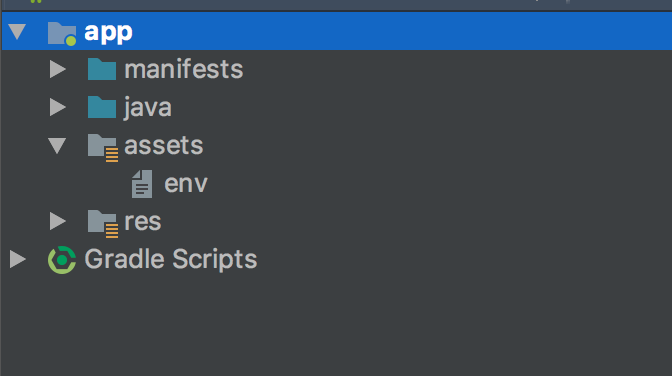

# 🗝️ java-dotenv 

   [](https://search.maven.org/search?q=g:%22io.github.cdimascio%22%20AND%20a:%22java-dotenv%22)  [  ](https://bintray.com/cdimascio/maven/java-dotenv/_latestVersion) [](https://app.codacy.com/app/cdimascio/java-dotenv?utm_source=github.com&utm_medium=referral&utm_content=cdimascio/java-dotenv&utm_campaign=Badge_Grade_Dashboard) [](#contributors) [](https://gitter.im/cdimascio-oss/community) 

A port of the Ruby dotenv project for Java and Kotlin. Load environment variables from a `.env` file.

<p align="center">
	 
</p>

Why dotenv?

>Storing configuration in the environment is one of the tenets of a [twelve-factor](http://12factor.net/config) app. Anything that is likely to change between deployment environments–such as resource handles for databases or credentials for external services–should be extracted from the code into environment variables.

>But it is not always practical to set environment variables on development machines or continuous integration servers where multiple projects are run. Dotenv load variables from a .env file into ENV when the environment is bootstrapped.

>-- [Brandon Keepers](https://github.com/bkeepers/dotenv)


Environment variables listed in the host environment override those in `.env`.  

Use `dotenv.get("...")` instead of Java's `System.getenv(...)`.  

## Install

### Maven 
```xml
<dependency>
    <groupId>io.github.cdimascio</groupId>
    <artifactId>java-dotenv</artifactId>
    <version>5.1.4</version>
</dependency>
```

### Gradle

```groovy
compile 'io.github.cdimascio:java-dotenv:5.1.4'
```

## Usage
Use dotenv.get("...") instead of Java's System.getenv(...). Here's [why](#faq).

Create a `.env` file in the root of your project

```dosini
# formatted as key=value
MY_ENV_VAR1=some_value
MY_EVV_VAR2=some_value
```

With **Java**

```java
import io.github.cdimascio.dotenv.Dotenv;

Dotenv dotenv = Dotenv.load();
dotenv.get("MY_ENV_VAR1")
```

or with **Kotlin** 

```kotlin
import io.github.cdimascio.dotenv.dotenv

val dotenv = dotenv()
dotenv["MY_ENV_VAR1"]
```

## Android Usage

- Create an assets folder
- Add `env` *(no dot)* to the assets folder.

	

- Configure dotenv to search `/assets` for a file with name `env`

	```kotlin
	val dotenv = dotenv {
	    directory = "/assets"
	    filename = "env" // instead of '.env', use 'env'
	}
	dotenv["MY_ENV_VAR1"]
	```

**Note:** The above configuration is required because dot files in `/assets` do not appear to resolve on Android. *(Seeking recommendations from the Android community on how `java-dotenv` configuration should work in order to provide the best experience for Android developers)*

Alternatively, if you are using Provider `android.resource` you may specify

```
 directory = "android.resource://com.example.dimascio.myapp/raw"
```

## Advanced Usage

### Configure
Configure `java-dotenv` once in your application. 

With **Java**

```java
Dotenv dotenv = Dotenv.configure()
        .directory("./some/path")
        .ignoreIfMalformed()
        .ignoreIfMissing()
        .load();
```

- see [configuration options](#configuration-options)

or with **Kotlin**

```kotlin
val dotenv = dotenv {
    directory = "./some/path"
    ignoreIfMalformed = true
    ignoreIfMissing = true
}
```

- see [Kotlin DSL configuration options](#configuration-options)

### Get environment variables
Note, environment variables specified in the host environment take precedence over those in `.env`.

With **Java**

```java
dotenv.get("HOME");
dotenv.get("MY_ENV_VAR1", "default value");
```

or with **Kotlin**

```kotlin
dotenv["HOME"]
dotenv["MY_ENV_VAR1"] ?: "default value"
```

### Iterate over environment variables
Note, environment variables specified in the host environment take precedence over those in `.env`.

With **Java**

```java
for (DotenvEntry e : dotenv.entries()) {
    System.out.println(e.getKey());
    System.out.println(e.getValue());
}
```

or with **Kotlin**

```kotlin
for (e in dotenv.entries()) {
    println(e.key)
    println(e.value)
}
```

## Configuration options

### *optional* `directory` 
* `path` specifies the directory containing `.env`. Dotenv first searches for `.env` using the given path on the filesystem. If not found, it searches the given path on the classpath. If `directory` is not specified it defaults to searching the current working directory on the filesystem. If not found, it searches the current directory on the classpath.

	**Java example**
	
	```java
	Dotenv
	  .configure()
	  .directory("/some/path")
	  .load()
	```

	**Kotlin Dsl example**
	
	```kotlin
	dotenv {
	  directory = "/some/path"
	}
    ```

### *optional* `filename`

* Use a filename other than `.env`. Recommended for use with Android (see [details](#android-usage)) 

	**Java example**
	
	```java
	Dotenv
	  .configure()
	  .filename("myenv")
	  .load()
	```
	**Kotlin Dsl example**
	
	```kotlin
	dotenv {
	    filename = "myenv"
	}
	```

### *optional* `ignoreIfMalformed`

* Do not throw when `.env` entries are malformed. Malformed entries are skipped.

	**Java example**
	
	```java
	Dotenv
	  .configure()
	  .ignoreIfMalformed()
	  .load()
	```
	**Kotlin Dsl example**
	
	```kotlin
	dotenv {
	  ignoreIfMalformed = true
	}
	```

### *optional* `ignoreIfMissing` 

* Do not throw when `.env` does not exist. Dotenv will continue to retrieve environment variables that are set in the environment e.g. `dotenv["HOME"]`

	**Java example**
	
	```java
	Dotenv
	  .configure()
	  .ignoreIfMissing()
	  .load()
	```
	**Kotlin Dsl example**
	
	```kotlin
	dotenv {
	  ignoreIfMissing = true
	}
	```

### *optional* `systemProperties` 

* Load environment variables into System properties, thus making all environment variables accessible via `System.getProperty(...)`

	**Java example**
	
	```java
	Dotenv
	  .configure()
	  .systemProperties()
	  .load()
	```
	**Kotlin Dsl example**
	
	```kotlin
	dotenv {
	  systemProperties = true
	}
	```

## Examples
- with [Maven (simple)](https://github.com/cdimascio/java-dotenv-example)
- with [Spring MVC](https://github.com/cdimascio/kotlin-spring-mvc-template)
- with [Spring Webflux](https://github.com/cdimascio/kotlin-swagger-spring-functional-template)
- with [Android](https://github.com/cdimascio/android-example/blob/master/app/src/main/java/com/example/dimascio/myapp/MainActivity.kt) 
- see [Kotlin DSL tests](./src/test/kotlin/tests/DslTests.kt)
- see [Java tests](./src/test/java/tests/JavaTests.java)

## FAQ

**Q:** Should I deploy a `.env` to e.g. production?

**A**: Tenant III of the [12 factor app methodology](https://12factor.net/config) states "The twelve-factor app stores config in environment variables". Thus, it is not recommended to provide the .env file to such environments. dotenv, however, is super useful in e.g a local development environment as it enables a developer to manage the environment via a file which is more convenient.

Using dotenv in production would be cheating. This type of usage, however is an anti-pattern.

**Q:** Why should I use `dotenv.get("MY_ENV_VAR")` instead of `System.getenv("MY_ENV_VAR")`

**A**: Since Java does not provide a way to set environment variables on a currently running process, vars listed in `.env` cannot be set and thus cannot be retrieved using `System.getenv(...)`.

**Q**: Can I use `System.getProperty(...)` to retrieve environment variables?

**A**: Sure. After initializing dotenv set each env var into system properties. For example:

Java
```java
Dotenv dotenv = Dotenv.configure().load();
dotenv.entries().forEach(e -> System.setProperty(e.getKey(), e.getValue()));
System.getProperty("MY_VAR");
```

Kotlin
```kotlin
val dotenv = dotenv()
dotenv.entries().forEach { (key, value) -> System.setProperty(key, value) }
```

**Q:** Should I have multiple .env files?

**A**: No. We strongly recommend against having a "main" .env file and an "environment" .env file like .env.test. Your config should vary between deploys, and you should not be sharing values between environments.

> In a twelve-factor app, env vars are granular controls, each fully orthogonal to other env vars. They are never grouped together as “environments”, but instead are independently managed for each deploy. This is a model that scales up smoothly as the app naturally expands into more deploys over its lifetime.

>– The Twelve-Factor App

**Q**: Should I commit my `.env` file?

**A**: No. We strongly recommend against committing your `.env` file to version control. It should only include environment-specific values such as database passwords or API keys. Your production database should have a different password than your development database.

**Q**: What happens to environment variables that were already set?

**A**: java-dotenv will never modify any environment variables that have already been set. In particular, if there is a variable in your `.env` file which collides with one that already exists in your environment, then that variable will be skipped. This behavior allows you to override all `.env` configurations with a machine-specific environment, although it is not recommended.

**Q**: What about variable expansion in `.env`? 

**A**: We haven't been presented with a compelling use case for expanding variables and believe it leads to env vars that are not "fully orthogonal" as [The Twelve-Factor App outlines](https://12factor.net/config). Please open an issue if you have a compelling use case.

**Q**: Can I supply a multi-line value?

**A**: java-dotenv exhibits the same behavior as Java's `System.getenv(...)`, thus if a multi-line value is needed you might consider encoding it via e.g. Base64. see this [comment](https://github.com/cdimascio/java-dotenv/issues/28#issuecomment-489443975) for details.


**Note and reference**: The FAQs present on [motdotla's dotenv](https://github.com/motdotla/dotenv#faq) node project page are so well done that I've included those that are relevant in the FAQs above.

## Contributors
Contributions are welcome!
<!-- ALL-CONTRIBUTORS-LIST:START - Do not remove or modify this section -->
<!-- prettier-ignore -->
<table><tr><td align="center"><a href="http://www.twitter.com/carminedimascio"><br /><sub><b>Carmine DiMascio</b></sub></a><br /><a href="https://github.com/cdimascio/java-dotenv/commits?author=cdimascio" title="Code">💻</a> <a href="https://github.com/cdimascio/java-dotenv/commits?author=cdimascio" title="Documentation">📖</a> <a href="#infra-cdimascio" title="Infrastructure (Hosting, Build-Tools, etc)">🚇</a></td><td align="center"><a href="https://github.com/arniu"><br /><sub><b>Arniu Tseng</b></sub></a><br /><a href="https://github.com/cdimascio/java-dotenv/commits?author=arniu" title="Code">💻</a> <a href="https://github.com/cdimascio/java-dotenv/commits?author=arniu" title="Documentation">📖</a> <a href="#infra-arniu" title="Infrastructure (Hosting, Build-Tools, etc)">🚇</a></td><td align="center"><a href="http://pwoolcoc.gitlab.io"><br /><sub><b>Paul Woolcock</b></sub></a><br /><a href="#ideas-pwoolcoc" title="Ideas, Planning, & Feedback">🤔</a></td><td align="center"><a href="https://github.com/Playacem"><br /><sub><b>Playacem</b></sub></a><br /><a href="https://github.com/cdimascio/java-dotenv/commits?author=Playacem" title="Code">💻</a></td></tr></table>

<!-- ALL-CONTRIBUTORS-LIST:END -->

see [CONTRIBUTING.md](CONTRIBUTING.md)

## License

see [LICENSE](LICENSE) ([Apache 2.0](LICENSE))

<a href="https://www.buymeacoffee.com/m97tA5c" target="_blank"></a>
